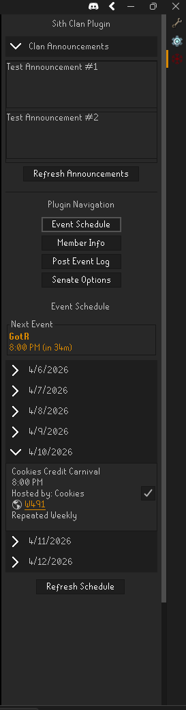
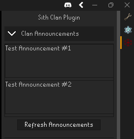
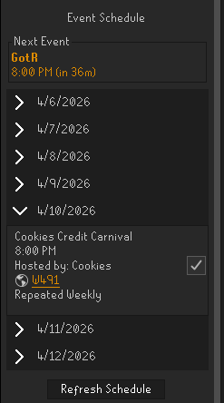
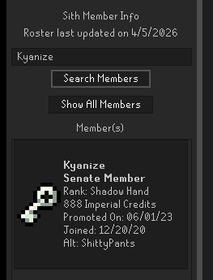
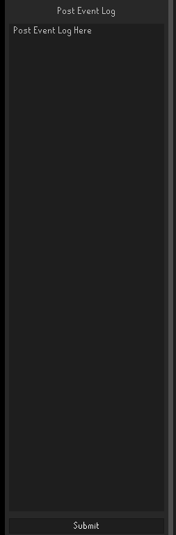
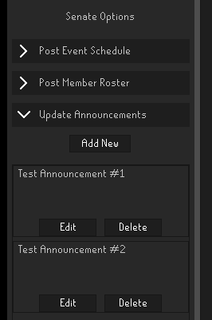
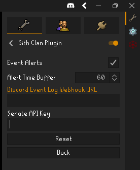

# Sith Clan Plugin

A [RuneLite](https://runelite.net/) plugin for members of the Sith clan in Old School Runescape.

| NOTE: This plugin will only work for members of the Sith clan in-game. |
| --- |

## Features

### Side Panel Interface

The plugin includes a dedicated panel that connects users to each of the plugins available features using navigation buttons and dropdown interfaces. The panel is accessible via a Sith clan navigation icon on RuneLite's right edge navigation panel.

### Clan Announcements

View clan announcements such as bingo dates, Wise Old Man links, upcoming events, etc. The refresh button will update the UI to show any new announcements.

### Event Schedule

View the clans weekly event schedule including each events specific information. Click on world links to quick hop to that events world. Checkboxes allow setting up an in-game notification before the event starts, configurable in the plugin settings.

### Member Info

View clan member information including rank, upcoming promotions, clan credits, etc. The entire clan roster can also be viewed.

### Post Event Log

Post event logs conveniently from the plugin that will post directly to the applicable event log channel on the Sith Discord server. The format used should match the Discord Code Block option and default format for the [Clan Event Attendance](https://github.com/JoRouss/runelite-ClanEventAttendance) plugin.

### Senate (Clan Leadership) Options _(Senate members only)_

Features options that allow for managing the Sith clan plugin info. This section is viewable and usable by Senate members only via an assigned API key saved in the plugin settings.

## Configuration

Open the RuneLite settings panel by clicking the wrench icon at the top of the right navigation bar and search **Sith Clan Plugin** to access the following options:

| Setting                       | Description                                                    | Default   |
| ----------------------------- | -------------------------------------------------------------- | --------- |
| Event Alerts                  | Enables or disables notifications for upcoming clan events     | Off       |
| Alert Time Buffer             | How many minutes before an event the notification fires (1–60) | 15        |
| Discord Event Log Webhook URL | The Discord webhook URL used to post event logs                | _(empty)_ |
| Senate API Key                | API key granting access to Senate member options               | _(empty)_ |

| NOTE: The Discord Webhook URL will need to be obtained from a qualified Sith clan member. |
| --- |

| NOTE: Senate API keys will be handed out by the plugins author only. |

## Installation

### RuneLite Plugin Hub

1. Open the RuneLite client.
2. Click on the wrench icon at the top of the right navigation bar. (Configuration)
3. Click on the Plugin Hub button. (cord plug icon)
4. Search for "Sith Clan".
5. Click Install.

## Support

For bug reports, questions, and feature requests, please open an issue on the [GitHub Repository](https://github.com/psenk/SithClanPlugin).

## Development

Information from the plugin is sent to a CloudFlare worker backend.  The public repository for this can be found [here](https://github.com/psenk/SithClanPluginAPI).

## License

This project is licensed under the BSD 2-Clause License -- see the LICENSE file for details.

## Acknowledgements

Portions of this plugin were inspired by or derived from:

- [Clan Event Attendance](https://github.com/JoRouss/runelite-ClanEventAttendance) - Licensed under BSD 2-Clause License
- [World Hopper](https://github.com/runelite/runelite/tree/master/runelite-client/src/main/java/net/runelite/client/plugins/worldhopper) - Licensed under BSD 2-Clause License

See the LICENSES directory for third-party details.
